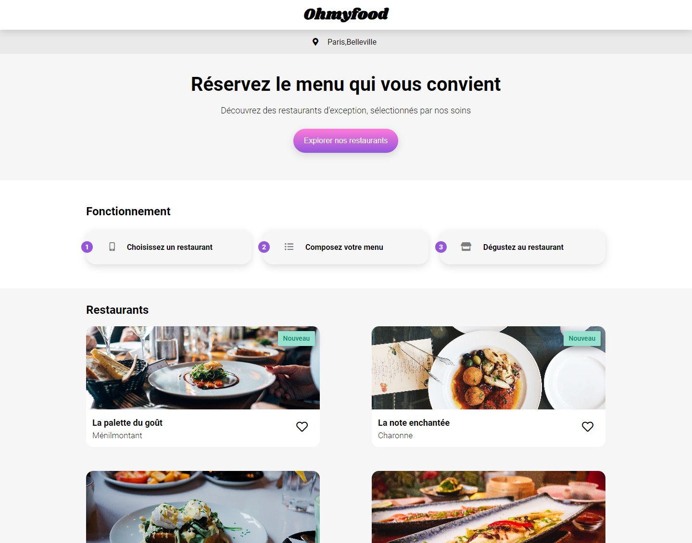
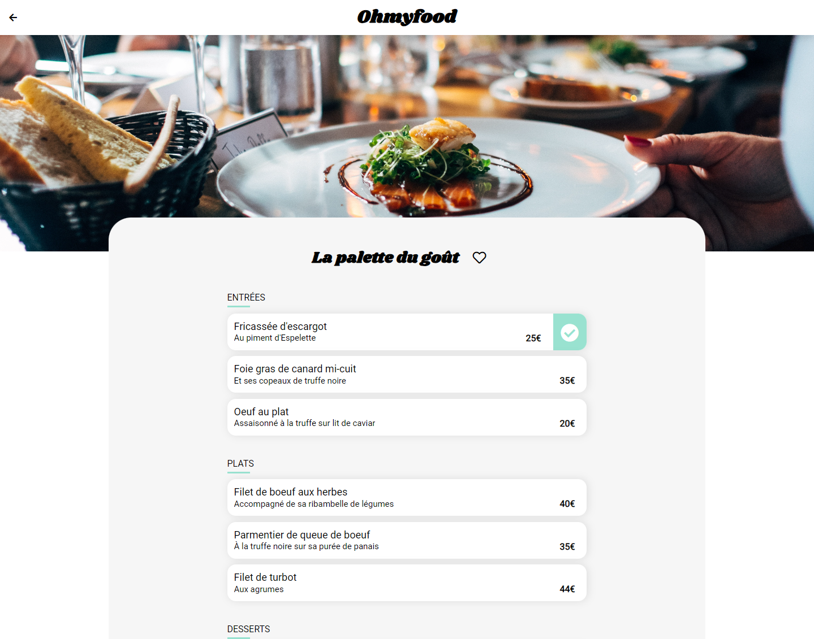

  

##

 Ohmyfood est une entreprise de commande de repas en ligne. Notre concept permet aux utilisateurs de composer leur propre menu et réduire leur temps d’attente dans les restaurants car leur menu est préparé à l’avance. Plus de perte de temps à consulter la carte !

[Lien vers Ohmyfood]()

## 📝 Table des matières

- [Objectifs](#objectifs)
- [Construit avec](#built_using)
- [Auteur](#auteur)
- [Images](#images)

## 🚀 Objectifs 
Développer un site proposant le menu de 4 grands restaurants parisiens.
Permettre la réservation en ligne et la composition de menus.

## ⛏️ Construit avec 

  HTML
   
  CSS

## ✍️ Auteur 

[Cyril Votion](https://github.com/Cyril-vtn)

## 📸 Images 

</a>
 </a>
